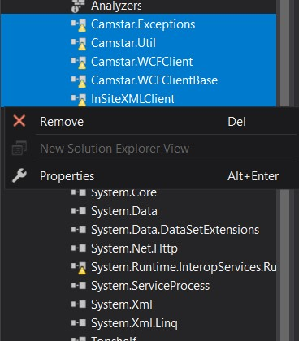
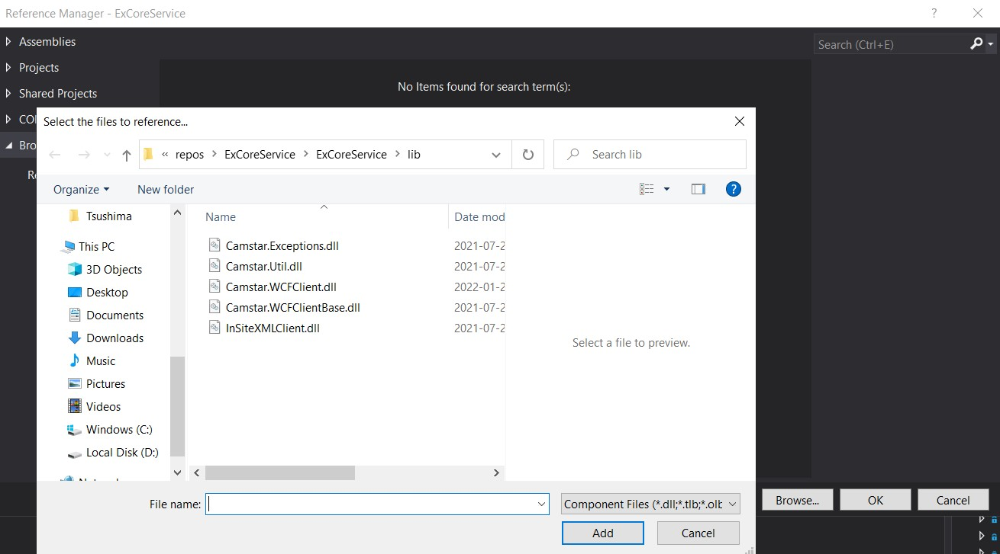
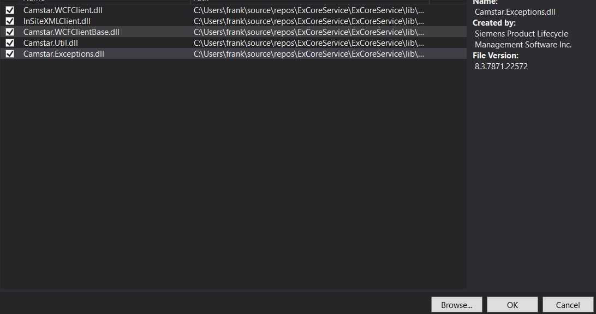
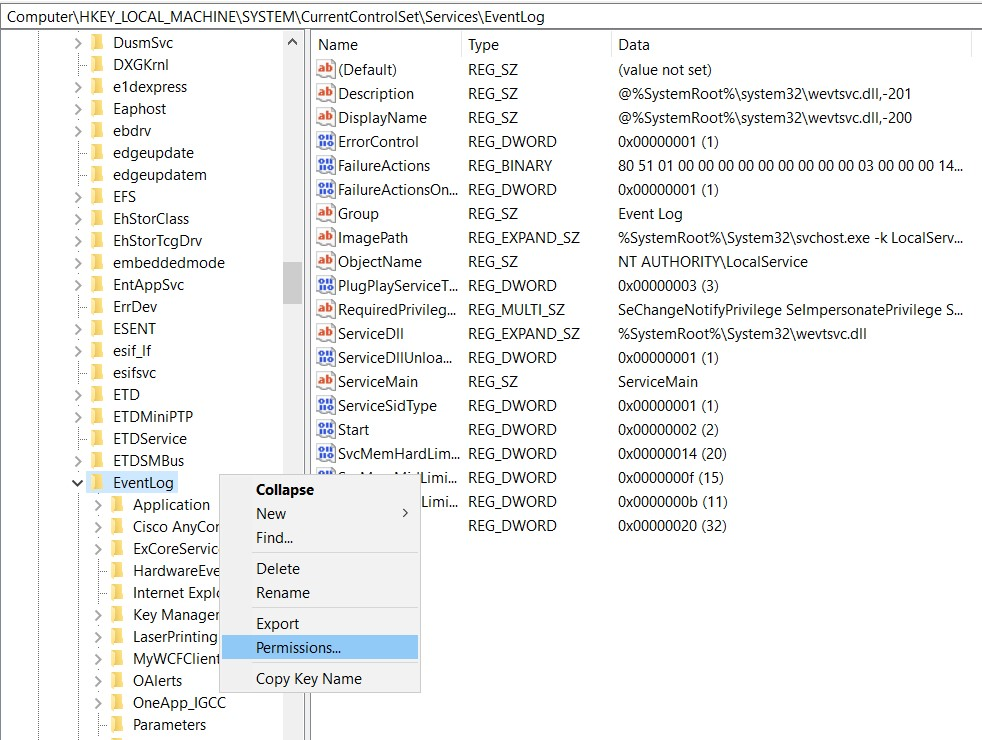
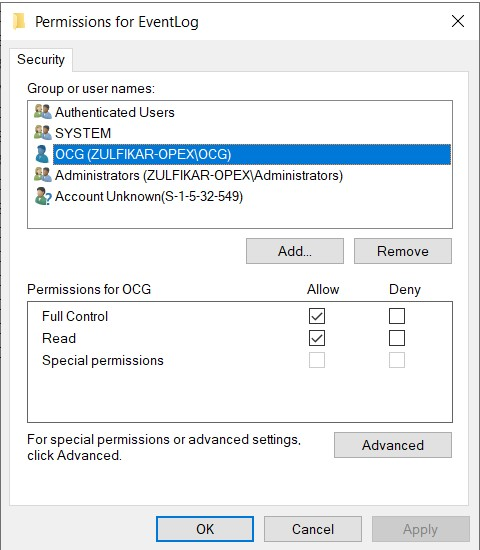
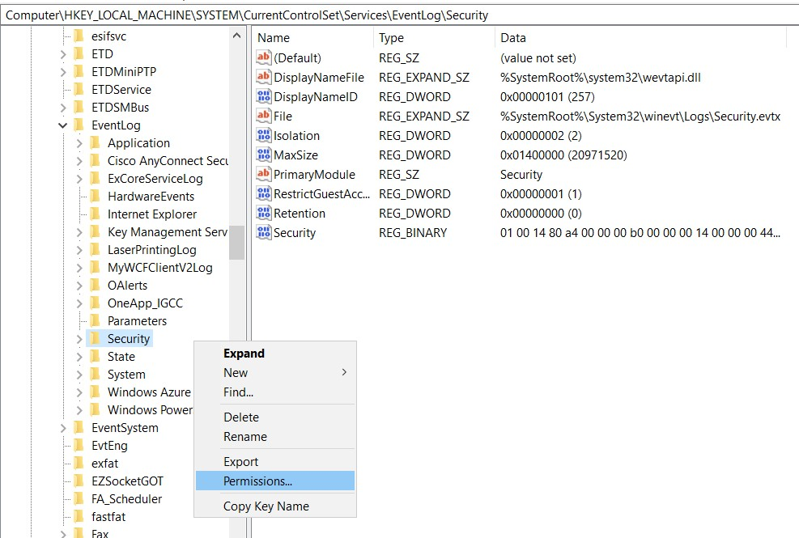
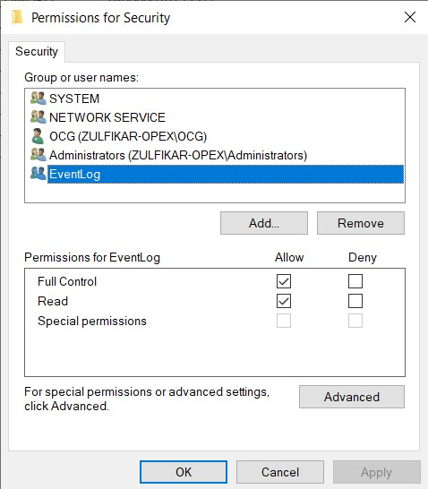

# How this service were created
This service Install TopShelf in NuGetPackage, and this is using Timer that mean every 1 second would be write timestamp date and time to certain file.

# How to install `.dll` Opcenter to project

* Remove Warning `.dll` file
    * Select the `.dll` in reference, and click remove </br>
</br>

* Click add Reference</br>
</br>

* Click Browse
    * Select the all library in folder `/lib`, like in the picture.</br>
</br>

* Select the `.dll` file and click ok</br>
</br>

# Enabled Event Log on windows Machine
- Log on to the computer as an administrator.
- Click Start, click Run, type Regedit in the Open box, and then click OK. - The Registry Editor window appears.
- Locate the following registry subkey
```
Computer\HKEY_LOCAL_MACHINE\SYSTEM\CurrentControlSet\Services\EventLog
```
- Right-click Eventlog, and then click Permissions. The Permissions for Eventlog dialog box appears.



- Click Add, add the user account or group that you want and set the following permissions: `Full Control`.



- Locate the following registry subkey
```
Computer\HKEY_LOCAL_MACHINE\SYSTEM\CurrentControlSet\Services\EventLog\Security
```



- Click Add, add the user account or group that you want and set the following permissions: `Full Control`.



# Documentation API
- [Service Util API](./ExCoreService/README.md)
# How deploy the service
Run as Administrator the file `InstallServices.cmd`. And Copy the folder path for each Services 1 by 1 per service, for example:
```
Where's the path Installer File of ExCoreServiceOrder: C:\Users\zul\source\repos\ExCoreService\ExCoreServiceOrder\bin\Release
Where's the path Installer File of ExCoreServiceOrderBOM: C:\Users\zul\source\repos\ExCoreService\ExCoreServiceOrderBOM\bin\Release
Where's the path Installer File of ExCoreServiceProductMaster: C:\Users\zul\source\repos\ExCoreService\ExCoreServiceProductMaster\bin\Release
```
Or you can directly find the `InstallService.cmd` in folder ExCoreServiceProductMaster\bin\Release, after you compiled this project.
# How uninstall the service
Run as Administrator the file `UninstallServices.cmd`. And Copy the folder path for each Services 1 by 1 per service, for example:
for example:
```
Where's the path Installer File of ExCoreServiceOrder: C:\Users\zul\source\repos\ExCoreService\ExCoreServiceOrder\bin\Release
Where's the path Installer File of ExCoreServiceOrderBOM: C:\Users\zul\source\repos\ExCoreService\ExCoreServiceOrderBOM\bin\Release
Where's the path Installer File of ExCoreServiceProductMaster: C:\Users\zul\source\repos\ExCoreService\ExCoreServiceProductMaster\bin\Release
```
Or you can directly find the `UninstallService.cmd` in folder ExCoreServiceProductMaster\bin\Release, after you compiled this project.
# Released Notes
- [v1.0.1](https://github.com/zulfikar4568/ExCoreService/releases/tag/v1.0.1) Import Order BOM (Material List) and Order (Production Order)
- [v1.0.2](https://github.com/zulfikar4568/ExCoreService/releases/tag/v1.0.2) Fixing Bug (Order BOM import Error When Route Steps Sequence is null)
- [v1.0.3](https://github.com/zulfikar4568/ExCoreService/releases/tag/v1.0.3) Add validation field CSV, Field can be configured from the config, Service created separately,Service Migrate to Library

# License & Copy Right
© M. Zulfikar Isnaen, This is Under [MIT License](LICENSE).